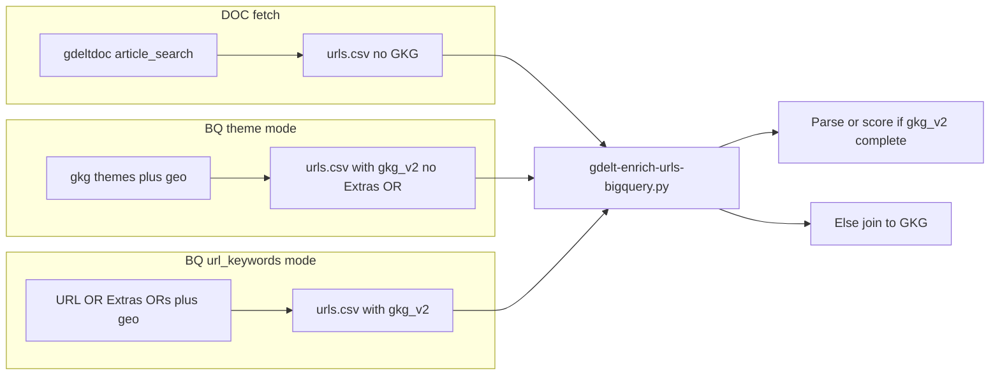

# Optimize BQ fetch vs enrich; drop SharingImage; DOC behavior

## Mode behavior (explicit)

| BigQuery `bigquery_gkg_fetch.mode` | Discovery predicate (unchanged intent) | EXTRAS / title |
|-----------------------------------|----------------------------------------|----------------|
| **`themes`** | `(V2Themes OR …) AND (V2Locations OR …) AND partition` — **same as today**, plus extended SELECT only | **Do not add** `Extras` — retain original theme-mode behavior. |
| **`url_keywords`** | `(DocumentIdentifier LIKE …) AND V2Locations AND partition` | **Extend** with `(DocumentIdentifier ORs) OR (Extras ORs)` as in section E — URL patterns **or** EXTRAS patterns (keywords from meta). |

---

## Confirmed behavior (DOC question)

**`--source doc` does not return `V2Themes`, `V2Locations`, `V2Tone`, etc.**

- The DOC path only writes columns from [`_URLS_CSV_COLS_DOC`](scripts/gdelt-fetch-urls.py) (`event_id`, `url`, `title`, `seendate`, `domain`, …). Rows come from `gdeltdoc` / GDELT DOC article search — **not** GKG record fields.
- The GDELT DOC API is **not** `gkg_partitioned`; there is **no** way in this repo to request GKG columns from the DOC client. **[`gdelt-enrich-urls-bigquery.py`](scripts/gdelt-enrich-urls-bigquery.py)** (or local [`gdelt-enrich-urls.py`](scripts/gdelt-enrich-urls.py)) remains necessary for DOC-sourced URLs unless the architecture changes.

**Implication:** You cannot avoid a second GKG lookup for the DOC path by extending the DOC response.

---

## Current gap (why enrich re-queries after BigQuery fetch)

1. **`url_keywords` mode** already selects `V2Themes`, `V2Locations`, `V2Tone` in [`build_gkg_partitioned_fetch_sql_url_keywords`](scripts/gdelt-fetch-urls.py) and maps to `gkg_v2_*` when `has_gkg_cols` is true.
2. **`themes` mode** uses [`build_gkg_partitioned_fetch_sql`](scripts/gdelt-fetch-urls.py), whose SELECT today omits `V2Themes` / `V2Locations` / `V2Tone` (and includes `SharingImage`). Theme-mode CSVs often lack `gkg_v2_*`; enrich re-queries GKG.
3. **Enrich** also pulls **`V2Persons`**, which fetch does not select in either mode.

---

## Recommended implementation

### A. [`scripts/gdelt-fetch-urls.py`](scripts/gdelt-fetch-urls.py)

1. **`build_gkg_partitioned_fetch_sql` (theme mode):** Extend SELECT with **`g.V2Themes`, `g.V2Locations`, `g.V2Tone`**, optionally **`g.V2Persons`**. **Remove `g.SharingImage`.** **Do not** add `Extras` predicates — **predicate structure stays** `(theme ORs) AND (location ORs) AND partition`.
2. **`build_gkg_partitioned_fetch_sql_url_keywords` (URL mode):** Add **`V2Persons`** if desired; **remove `SharingImage`**. Keep `V2Themes` / `V2Locations` / `V2Tone`. **Add** `Extras` OR block per section E (URL mode only).
3. **CSV schema:** Remove **`socialimage`** from [`_URLS_CSV_COLS_DOC`](scripts/gdelt-fetch-urls.py) and [`write_csv_and_summary`](scripts/gdelt-fetch-urls.py); add **`gkg_v2_persons`** when present; wire theme-mode to emit `gkg_v2_*` once theme SQL returns those columns.
4. **Summary text:** Update notes for optional enrich skip when `gkg_v2_*` present; clarify **EXTRAS expansion applies only when `mode` is `url_keywords`**.

### E. EXTRAS / title keyword search — **URL mode only** (`url_keywords`)

**Goal:** Recall rows where the **slug** misses `url_keyword_patterns` but **`Extras`** (includes `<PAGE_TITLE>...</PAGE_TITLE>` in GKG 2.0) still matches domain phrases.

**Where:** Only [`build_gkg_partitioned_fetch_sql_url_keywords`](scripts/gdelt-fetch-urls.py). **Not** used in [`build_gkg_partitioned_fetch_sql`](scripts/gdelt-fetch-urls.py) (theme mode).

**Predicate grouping:**

`( (DocumentIdentifier LIKE …) OR (Extras LIKE … OR …) ) AND V2Locations LIKE … AND _PARTITIONTIME …`

**Keyword sources (from meta):**

1. **`bigquery_gkg_fetch.url_keyword_patterns`** — normalize (`%` stripped); `Extras LIKE` with consistent hyphen/space handling; dedupe.
2. **`gdelt_doc_fetch.keywords`** — add each phrase as `Extras LIKE '%phrase%'` (SQL-escape quotes).
3. Optional: cap list size via meta (e.g. `extras_match_max_terms`).

**SQL options:** Simple `Extras LIKE` on full `Extras` vs stricter `REGEXP_EXTRACT` on `<PAGE_TITLE>` then match — implementation choice; document cost/coverage tradeoffs.

**Code:** Helper e.g. `extras_or_sql_fragment(patterns, doc_keywords) -> str` used only from the URL-keywords builder.

### B. [`scripts/gdelt-enrich-urls-bigquery.py`](scripts/gdelt-enrich-urls-bigquery.py)

1. **Skip BQ join** when input has `gkg_v2_themes` + `gkg_v2_locations` (+ `gkg_v2_tone` as today); parse/score locally; define fallback if columns missing.
2. **Join path:** Remove **`SharingImage`** from SELECT and **`sharing_image`** from output; keep **`V2Persons`** for DOC inputs.
3. Optional CLI **`--force-bigquery`** / **`--skip-bigquery`** for overrides.

### C. [`README.md`](README.md)

DOC → enrich required; BQ fetch with full `gkg_v2_*` → enrich may skip BQ; **EXTRAS OR only in `url_keywords` mode**; removed `socialimage`.

### D. Optional

[`gdelt-enrich-urls.py`](scripts/gdelt-enrich-urls.py): drop `SharingImage` from GKG column list if desired.

### F. Dropping `SharingImage` / `socialimage` / `sharing_image` — safety and legacy compatibility

**Repo audit (scripts / server / frontend):**

- **[`server/`](server/)** and **[`frontend/`](frontend/)**: no references to `SharingImage`, `socialimage`, or `sharing_image` (grep). No API or UI changes **required** for removal.
- **Scripts that currently reference these fields:** [`gdelt-fetch-urls.py`](scripts/gdelt-fetch-urls.py) (CSV columns + BQ SELECT), [`gdelt-enrich-urls-bigquery.py`](scripts/gdelt-enrich-urls-bigquery.py) (BQ SELECT + enriched column `sharing_image`), [`gdelt-enrich-urls.py`](scripts/gdelt-enrich-urls.py) (GKG column list including `SharingImage`). These are the only touchpoints to update.

**[`convert_csv_to_geojson.py`](scripts/convert_csv_to_geojson.py):** Feature properties are built only from `data_binding.final_report_csv.properties_suggested` **intersected** with `df.columns` — domain metas (e.g. HWC) do **not** list `socialimage` / `sharing_image`. Extra columns in a legacy CSV are **ignored** for GeoJSON props unless added to meta. **No change required** for forward compatibility; legacy CSVs with extra columns remain valid.

**Backward compatibility requirements (implementation must satisfy):**

1. **Readers:** Any code path that might see **old** enriched CSVs or merged data must not assume `socialimage` or `sharing_image` exists — use **`row.get("sharing_image")` / column-in-`df.columns`** checks before optional use. New writes omit these columns; **pandas `merge`** and **`reindex`** should not list removed columns as required.
2. **Legacy CSVs:** Pipelines that `read_csv` and forward columns should **preserve unknown columns** where appropriate, or explicitly drop only when rewriting — avoid hard failures if `socialimage` is present.
3. **GeoJSON:** Existing published GeoJSON with extra properties (if any) still loads in the map as generic props; the frontend does not depend on image URL fields per audit. **Optional:** strip on export only if product wants smaller files — not required for correctness.
4. **Post-change verification:** Re-run grep on `server/`, `frontend/`, `scripts/` after edits; smoke-test map layer load with an **old** CSV/GeoJSON artifact if available.

---

## Edge cases

| Case | Suggestion |
|------|------------|
| Mixed CSV (some rows lack `gkg_v2_*`) | If any row missing GKG columns, use full BQ join. |
| Theme mode users | No EXtras change; behavior matches pre-plan theme discovery + extended SELECT. |

---

## Diagram

