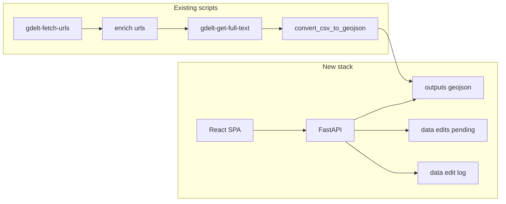

# React map viewer, FastAPI backend, IDs, and generalized prefixes

## 1. Stable point IDs (pipeline)

- **Column name:** `event_id` (UUID string, stable across dedup and merges).
- **`gdelt-fetch-urls.py`:** After combining/deduplicating by `url`, assign `uuid.uuid4().hex` (or `str(uuid.uuid4())`) per row so each retained article has a unique `event_id`. Include `event_id` in the saved CSV columns (alongside `url`, `title`, …).
- **`gdelt-enrich-urls.py` / `gdelt-enrich-urls-bigquery.py`:** Require `event_id` on input (or migration adds it). All merges on `url` must **preserve `event_id` from the articles side**; never drop the column in filtered outputs.
- **`gdelt-get-full-text.py`:** Pass `event_id` through first run and Selenium retry; include in every output row. Update `geo_path` merge for retry: resolve `*_urls_geocoded.csv` using the same prefix rule (see §2) instead of hardcoded `hwc_urls_geocoded.csv`.
- **`convert_csv_to_geojson.py`:** Add `event_id` to GeoJSON **Feature `properties`** and set RFC 7946 **Feature `id`** to the same value for client convenience.

## 2. Filename prefix from meta (underscore rule)

- **Rule (per your choice):** `prefix = meta_stem.split("_")[0].lower()` where `meta_stem` is `Path(meta).stem`; if there is no `_`, fall back to `meta_stem[:3].lower()` (document in README).
- **Central helper:** `scripts/domain_paths.py` with `output_prefix(meta_path: Path) -> str` and path helpers for `{prefix}_urls.csv`, `{prefix}_final_report.csv`, etc.
- **Update defaults** in fetch, enrich, BQ, get-full-text, convert_csv_to_geojson so default paths use `prefix` from `--meta` (default remains `meta/hwc_india_conflict_meta.json` → prefix `hwc`, preserving today’s `hwc`_* names).
- **Docs:** README — document prefix rule and `--meta`.
- **BigQuery:** Optional follow-up: parameterize `gdelt_hwc_temp` / table names if you need isolated BQ resources per domain; otherwise leave as-is for MVP.

## 3. One-off migration script (existing data)

- **Script:** `scripts/migrate_add_event_ids.py` (temporary, documented in README).
  - Load each existing CSV in `data/` that participates in the pipeline (or a configurable list): assign **deterministic** `event_id` = `uuid.uuid5(namespace, url)` (same namespace for all) so the same URL always gets the same ID without re-running fetch.
  - Write updated CSVs in place or to `--out-dir` with backup option.
  - Regenerate or patch `outputs/{prefix}_points.geojson`: add `properties.event_id` and Feature `id` by joining from the final report CSV on `url` or row order if needed (prefer join on `url` + `event_date` if duplicates exist).

## 4. Backend (FastAPI + Uvicorn)

- **Layout:** `server/` with `main.py`, session auth, routes for layers, edits, moderation.
- **Static SPA:** Build React to `frontend/dist` and mount with `StaticFiles`, or serve API only and proxy in dev (document both).
- **Config:** env vars: `REPO_ROOT`, `GIT_AUTO_COMMIT` (optional), `SESSION_SECRET`, paths to `data/`, `outputs/`, `meta/`.
- **APIs:**
  - `GET /api/meta/layers` — list `meta/*.json` excluding `event_domain_template.json`; return `id`, `label` (from `domain.title`), path, derived `prefix`, and matching GeoJSON path `{prefix}_points.geojson` under `outputs/` if present.
  - `GET /api/layers/{layer_id}/geojson` — return JSON for selected layer (validate path under `outputs/`).
  - `GET /api/layers/{layer_id}/style` — return `map_style.colors_hex` + category field from meta for map styling (avoid parsing QML in the browser; QML stays for QGIS).
  - `POST /api/edits` — body: `{ point_id, layer_id, suggested_properties, note? }`; assign `edit_id` (UUID); save JSON file under `data/edits/pending/{edit_id}.json`.
  - `POST /api/auth/login` — moderator username/password; verify against `data/moderators.json` (bcrypt hashes only); session cookie.
  - `GET /api/moderation/edits` — list pending edits (auth).
  - `POST /api/moderation/edits/{edit_id}/apply` — merge suggested properties into canonical GeoJSON feature for `point_id`, append record to `data/edit_log.jsonl`, optionally delete pending file.
  - `DELETE /api/moderation/edits/{edit_id}` — delete pending suggestion.
- **Git:** After writing `outputs/{prefix}_points.geojson` and edit log, if `GIT_AUTO_COMMIT=1`, run `git add` + `git commit` with a message including `edit_id` and `point_id` (subprocess; validate cwd is repo root). If disabled, only write files.

## 5. Frontend (React)

- **Stack:** Vite + React + TypeScript; **MapLibre GL** + GeoJSON source; style circles using `/api/layers/.../style` colors by `map_category` (or domain category field).
- **Right panel:** Fixed width; on map click, show feature `properties` (metadata); **Suggest edit** form (JSON properties + note).
- **Search:** Single text input; client-side filter on selected property values (`title`, `species`, `event_type`, `url`, `map_category`, etc.).
- **Layer dropdown:** Populate from `GET /api/meta/layers`; on change, reload GeoJSON + style.
- **Moderator:** Login modal; after auth, pending edits for the selected `point_id` with Apply / Delete.

## 6. Auth file format

Example `data/moderators.json` (manually editable):

```json
{
  "users": [
    { "username": "admin", "password_hash": "<bcrypt hash>" }
  ]
}
```

Generate hashes via `python scripts/hash_password.py`.

## 7. Architecture sketch



## Risks / notes

- **Underscore prefix:** Meta files must be named so the first segment is the intended short prefix (`hwc_india_...` → `hwc`). Avoid `event_domain_template.json` for real layers (already excluded in UI).
- **Security:** Rate-limit login; never log passwords; restrict file paths for layer GeoJSON to `outputs/`.
- **Large GeoJSON:** If files grow, consider later: PMTiles or vector tiles; MVP loads full GeoJSON as today.
